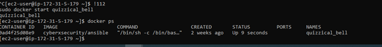
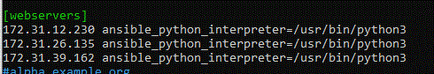
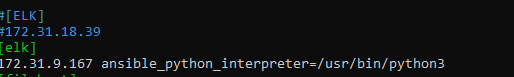

## Automated ELK Stack Deployment

The files in this repository were used to configure the network depicted below.

- [AWS Cloud Security Project drawio](https://user-images.githubusercontent.com/85351681/134754291-cc572da6-e664-46fd-bc02-31336756e98a.png)

These files have been tested and used to generate a live ELK deployment on Azure. They can be used to either recreate the entire deployment pictured above. Alternatively, select portions of the playbook file may be used to install only certain pieces of it, such as Filebeat.

- [filebeat-playbook.yml](filebeat-playbook.yml)
- [Elk install](install_elk.yml)
- MetricBeat(metricbeat_playbook.yml)

This document contains the following details:
- Description of the Topologu
- Access Policies
- ELK Configuration
  - Beats in Use
  - Machines Being Monitored
- How to Use the Ansible Build

### Description of the Topology

The main purpose of this network is to expose a load-balanced and monitored instance of DVWA, the D*mn Vulnerable Web Application.

Load balancing ensures that the application will be highly accessible/redundant/reliable, in addition to restricting access to the network.
-Load balancers protects the system from DDos attacks by shifting attack traffic. The advantage of a jump box is to give access to the user from a single node that can be secured and monitored.

Integrating an ELK server allows users to easily monitor the vulnerable VMs for changes to the logs and system traffic.
- Filebeat is lighweight shipper for forwarding and centralizing log data and monitors the log files or locations that you specify.
- Metricbeat records the metrics and statistics from the operation system and from services running on the server.

The configuration details of each machine may be found below.

| Name     | Function | IP Address    | Operating System |
|----------|----------|---------------|------------------|
| Jump Box | Gateway  | 172.31.5.179  | Linux    |
| Web1     | Server   | 172.31.39.169 | Linux    |
| Web2     | Server   | 172.31.12.230 | Linux    |
| Web3     | Server   | 172.31.26.135 | Linux    |
| ELK      | Server   | 172.31.9.167  | Linux    |

### Access Policies

The machines on the internal network are not exposed to the public Internet. 

Only the Jumpbox machine can accept connections from the Internet. Access to this machine is only allowed from the following IP addresses:
- 3.128.95.201

Machines within the network can only be accessed by each other
-  Web1, Web2 and Web3 send traffic to the ELK Server 

A summary of the access policies in place can be found in the table below.

| Name     | Publicly Accessible | Allowed IP Addresses |
|----------|---------------------|----------------------|
| Jump Box | Yes                 | 172.31.5.179         |
| Web1     | No                  | 172.31.5.179         |
| Web2     | No                  | 172.31.5.179         |
| Web3     | No                  | 172.31.5.179         |
|ELK Server| Yes                 | 172.31.5.179         |

### Elk Configuration

Ansible was used to automate configuration of the ELK machine. No configuration was performed manually, which is advantageous because using the configuration can be repeated automatically as new machines are added. Also if updates need to be made the changes can take place in one file and then run to update the individual machines

The playbook implements the following tasks:
- Install: docker.io
- Install: python3-pip
- Install: docker python module
- Download and launch docker container: ELK
- Enable docker service

The following screenshot displays the result of running `docker ps` after successfully configuring the ELK instance.

### Target Machines & Beats
This ELK server is configured to monitor the following machines:
- 172.31.39.162
- 172.31.12.230
- 172.31.26.135

We have installed the following Beats on these machines: Web1, Web2 and Web3
- Filebeat- Detects changes to the filesystem. Collects Apache logs
- Metricbeat- Detects changes in filesystem metrics such as CPU usage SSH login attempts, failed sudo escalations and CPU/RAM statistics

### Using the Playbook
In order to use the playbook, you will need to have an Ansible control node already configured. Assuming you have such a control node provisioned: 

SSH into the control node and follow the steps below:
- Update the hosts file within /etc/ansible and include the IPs of the Webservers
- 
- 

- Copy the playbook files to /etc/ansible. For example: /etc/ansible/filebeat-playbook.yml
- Update the configuration files for each beat to include the ELK server host information
- Copy the configuration files to /etc/ansible. For example: /etc/ansible/filebeat.yml
- Run the playbook, and navigate to http://3.142.35.241:5601/app/kibana#/home to check that the installation worked as expected.
